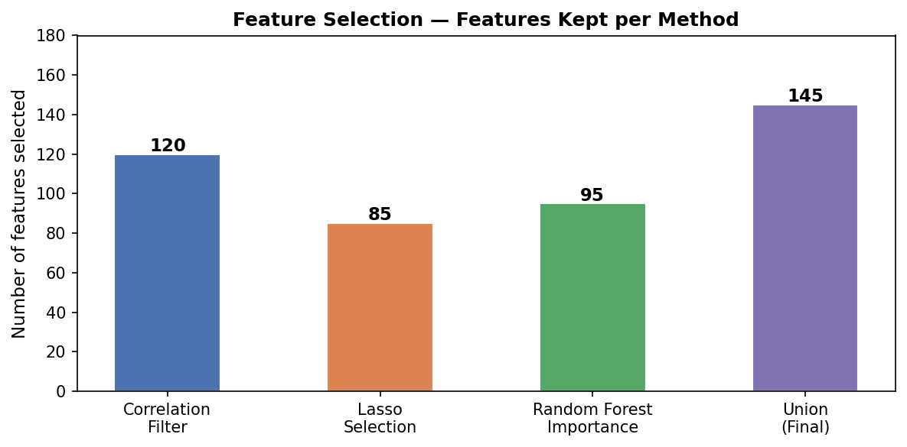
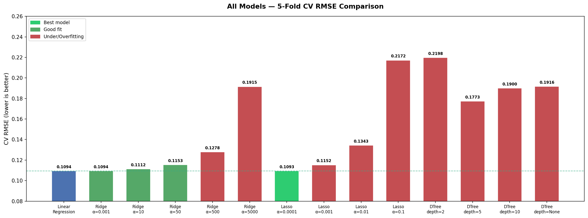
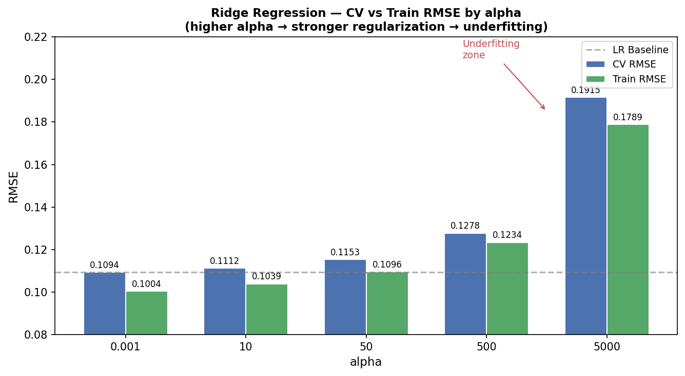
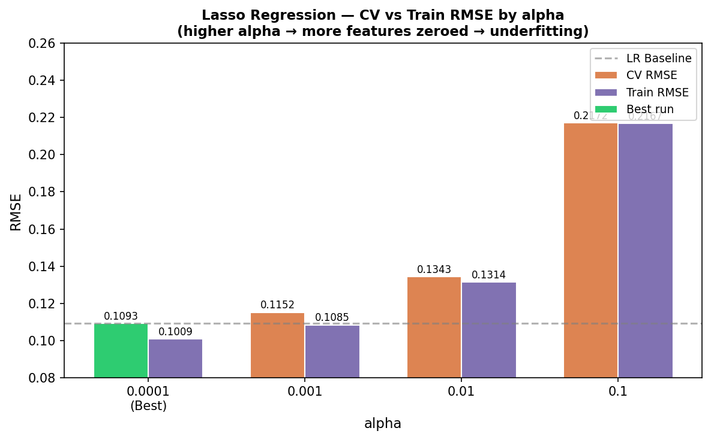
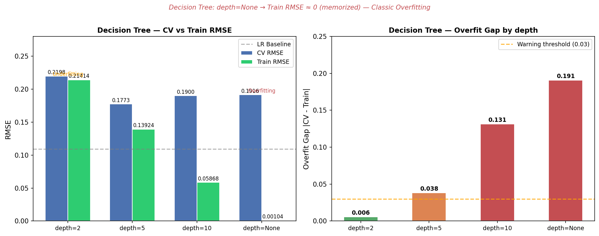

# 🏠 House Prices - Advanced Regression Techniques

## 📌 კონკურსის მიმოხილვა

[Kaggle House Prices](https://www.kaggle.com/competitions/house-prices-advanced-regression-techniques) კონკურსის მიზანია Iowa-ს Ames ქალაქში საცხოვრებელი სახლების გაყიდვის ფასის (`SalePrice`) პროგნოზირება 79 სხვადასხვა მახასიათებლის გამოყენებით — ფართობი, ხარისხი, მდებარეობა, რემონტის ისტორია და სხვა. შეფასება ხდება **RMSE**-ით log-transformed ფასებზე.

---

## 🧠 ჩემი მიდგომა

მონაცემების გაწმენდის შემდეგ ჩავატარე Feature Engineering, სამი სხვადასხვა მიდგომით ავარჩიე საჭირო სვეტები და გავტესტე 4 სხვადასხვა ტიპის მოდელი — სხვადასხვა hyperparameter-ებით. ყველა ექსპერიმენტი დავარეგისტრირე **MLflow**-ში DagsHub-ის საშუალებით და გამოვიყენე **5-Fold Cross Validation** მოდელის სიზუსტის შეფასებისთვის.

---

## 📁 რეპოზიტორიის სტრუქტურა

```
House-Prices/
├── data/
│   ├── train.csv
│   ├── test.csv
│   ├── X_test_final_sc.pkl
│   └── test_ids.pkl
├── model_experiment.ipynb
├── model_inference.ipynb
├── submission.csv
└── README.md
```

---

## 📄 ფაილების აღწერა

| ფაილი | აღწერა |
|---|---|
| `model_experiment.ipynb` | ძირითადი notebook — EDA, Cleaning, FE, FS, Training, MLflow |
| `model_inference.ipynb` | საუკეთესო მოდელი Model Registry-დან → prediction → submission |
| `submission.csv` | Kaggle-ზე ასატვირთი პროგნოზი |
| `data/train.csv` | 1460 ჩანაწერი, 81 სვეტი |
| `data/test.csv` | 1459 ჩანაწერი, 80 სვეტი |

---

## 🧼 Cleaning

### ➤ Outlier-ების მოცილება
ორი ჩანაწერი ამოვიღე სადაც `GrLivArea > 4000` და `SalePrice < 200,000`. ეს ორი სახლი ძალიან დიდი იყო მაგრამ ფასი არარეალურად დაბალი — Outlier-ები იყვნენ და regression ხაზს ამახინჯებდნენ.

### ➤ NaN მნიშვნელობების შევსება
5 სხვადასხვა სტრატეგია გამოვიყენე:
- სვეტები სადაც NA არარსებობას ნიშნავს → `"None"` ან `0`
- `LotFrontage` → Neighborhood-ის Median (სხვა სახლებთან მიახლოება)
- დანარჩენი categorical → `Mode`
- დანარჩენი numeric → `Median`

### ➤ Type Fix
`MSSubClass`, `MoSold`, `YrSold` — ნომინალური კოდები არიან (არა ნამდვილი რიცხვები), ამიტომ string-ად გარდავქმენი One-Hot Encoding-მდე.

---

## 🧬 Feature Engineering

### ➤ ახალი სვეტები
| სვეტი | ფორმულა / აღწერა |
|---|---|
| `TotalSF` | TotalBsmtSF + 1stFlrSF + 2ndFlrSF — სახლის სრული ფართობი |
| `TotalBath` | FullBath + 0.5 × HalfBath — სველი წერტილების ჯამი |
| `TotalPorchSF` | ყველა ვერანდის ფართობის ჯამი |
| `HouseAge` | YrSold − YearBuilt — სახლის ასაკი გაყიდვის დროს |
| `RemodelAge` | YrSold − YearRemodAdd — ბოლო რემონტის ასაკი |
| `IsRemodeled` | 1 თუ სახლი გარემონტდა, 0 თუ არა |
| `HasPool`, `HasGarage`, `HasBsmt`, `Has2ndFloor` | ბინარული Flag-ები |
| `OverallQual_TotalSF` | OverallQual × TotalSF — ხარისხი × ფართობი |

### ➤ Encoding
- **Ordinal Encoding** ხარისხის სვეტებისთვის (ExterQual, KitchenQual, BsmtQual...) → Po=1, Fa=2, TA=3, Gd=4, Ex=5
- **One-Hot Encoding** დანარჩენი categorical სვეტებისთვის (`pd.get_dummies`)

### ➤ Skewness Correction
- `SalePrice` → `log1p` გარდაქმნა, რათა target ნორმალური განაწილება ჰქონდეს
- სხვა skewed numeric სვეტები → **Box-Cox** გარდაქმნა (`|skew| > 0.5` threshold)

---

## 🔍 Feature Selection

სამი სხვადასხვა მიდგომა გამოვიყენე:

### ➤ მიდგომა 1: Correlation Filter
კორელაცია `SalePrice`-თან `|r| > 0.1`. მარტივი და სწრაფი მიდგომა, თუმცა ვერ იჭერს არახაზოვან კავშირებს.

### ➤ მიდგომა 2: Lasso Selection
`Lasso(alpha=0.001)` — coefficient = 0 მქონე სვეტები ამოვაგდე. L1 regularization-ი ავტომატურად ახდენს feature selection-ს.

### ➤ მიდგომა 3: Random Forest Importance
`RandomForestRegressor` — სვეტები `importance > 0.0005` threshold-ით. კარგია ნონლინეარული კავშირების დასაჭერად.

### ➤ საბოლოო შედეგი
სამივე მიდგომის **Union** — სვეტი დარჩა თუ ერთ-ერთ მიდგომაში მოხვდა. ეს მინიმუმამდე ამცირებს ინფორმაციის დაკარგვის რისკს.



---

## 🧪 Training

ყველა მოდელი შეფასდა **5-Fold Cross Validation**-ით.

 ძირითადი მეტრიკა: `CV RMSE`. Overfitting-ის შესაფასებლად ვიყენებდი `overfit_gap = |CV RMSE − Train RMSE|`.

---

##  Linear Models

### 🔹 Model 1: Linear Regression (Baseline)

პირველი მოდელი გავუშვი hyperparameter-ების გარეშე — უბრალო baseline-ის სახით.

```
CV RMSE:    0.10943
Train RMSE: 0.10045
Train R²:   0.93680
```

👉 კარგი საწყისი შედეგი. Overfit gap = 0.009 — მცირეა, მოდელი ბალანსურია. ეს არის benchmark ყველა შემდეგი მოდელისთვის.

---

### 🔹 Model 2: Ridge Regression (L2 Regularization)

Ridge-ი L2 regularization-ს იყენებს — ყველა coefficient-ს ამცირებს, მაგრამ ვერ ანულებს. `alpha` parameter-ი აკონტროლებს სიძლიერეს. 5 სხვადასხვა alpha გავტესტე:

#### alpha = 0.001
```
CV RMSE:    0.10941
Train RMSE: 0.10045
```
👉 Regularization პრაქტიკულად გამორთულია — Linear Regression-ის იდენტური შედეგი. alpha ძალიან პატარაა.

#### alpha = 10
```
CV RMSE:    0.11122
Train RMSE: 0.10394
```
👉 Regularization მუშაობს. CV RMSE ოდნავ გაუარესდა — ოდნავ Underfitting-ის ნიშნები.

#### alpha = 50
```
CV RMSE:    0.11533
Train RMSE: 0.10965
```
👉 Underfitting იზრდება. alpha ზედმეტად ამცირებს coefficient-ებს.

#### alpha = 500
```
CV RMSE:    0.12777
Train RMSE: 0.12342
```
👉 ძლიერი Underfitting. მოდელი ვეღარ ჭერს pattern-ებს.

#### alpha = 5000
```
CV RMSE:    0.19154
Train RMSE: 0.17887
```
👉 Extreme Underfitting — coefficient-ები თითქმის ნულია. მოდელი ვეღარ სწავლობს.

| alpha | CV RMSE | Train RMSE | ანალიზი |
|---|---|---|---|
| 0.001 | 0.10941 | 0.10045 | No regularization effect |
| 10 | 0.11122 | 0.10394 | Slight Underfitting |
| 50 | 0.11533 | 0.10965 | Underfitting |
| 500 | 0.12777 | 0.12342 | Strong Underfitting |
| 5000 | 0.19154 | 0.17887 | Extreme Underfitting |



---

### 🔹 Model 3: Lasso Regression (L1 Regularization)

Lasso Ridge-გან განსხვავდება — სუსტ სვეტებს coefficient-ს **ზუსტად 0-ზე** დებს, ანუ ახდენს ავტომატურ feature selection-ს. 4 alpha გავტესტე:

#### alpha = 0.0001 ⭐️ საუკეთესო
```
CV RMSE:    0.10930
Train RMSE: 0.10088
Train R²:   0.93625
```
👉 **საუკეთესო შედეგი ყველა მოდელს შორის.** Regularization სუსტია, მაგრამ საკმარისი. CV RMSE Linear Regression-ზე მცირედ კარგია.

#### alpha = 0.001
```
CV RMSE:    0.11523
Train RMSE: 0.10845
```
👉 Underfitting იწყება — ზედმეტი სვეტი ნულდება.

#### alpha = 0.01
```
CV RMSE:    0.13430
Train RMSE: 0.13136
```
👉 ძლიერი Underfitting. ბევრი სვეტი გამოირიცხა.

#### alpha = 0.1
```
CV RMSE:    0.21719
Train RMSE: 0.21675
```
👉 Extreme Underfitting — სვეტების უმეტესობა ნულდება, მოდელი ვეღარ მუშაობს.

| alpha | CV RMSE | Train RMSE | ანალიზი |
|---|---|---|---|
| 0.0001 | **0.10930** | 0.10088 | **საუკეთესო** |
| 0.001 | 0.11523 | 0.10845 | Underfitting |
| 0.01 | 0.13430 | 0.13136 | Strong Underfitting |
| 0.1 | 0.21719 | 0.21675 | Extreme Underfitting |



---

## 🌳 Tree-based Models

### 🔹 Model 4: Decision Tree Regressor

Decision Tree მონაცემებს ყოფს ხის სტრუქტურაში — თითოეულ კვანძზე ერთ feature-ზე დაყოფა, leaf-ში კი საშუალო ფასი. `max_depth` — ყველაზე მნიშვნელოვანი hyperparameter. 4 სხვადასხვა depth გავტესტე:

#### max_depth = 2
```
CV RMSE:    0.21975
Train RMSE: 0.21414
```
👉 ძლიერი Underfitting — ხე ძალიან მარტივია, ვერ ჭერს სახლის ფასის სირთულეს.

#### max_depth = 5
```
CV RMSE:    0.17732
Train RMSE: 0.13924
Overfit gap: 0.038 ⚠️
```
👉 Overfitting იწყება. Train-ზე უკეთ ახდენს, მაგრამ validation-ზე ცუდად. gap = 0.038.

#### max_depth = 10
```
CV RMSE:    0.19004
Train RMSE: 0.05868
Overfit gap: 0.131 ⚠️⚠️
```
👉 ძლიერი Overfitting. Train RMSE = 0.059 — ძალიან კარგია, მაგრამ CV RMSE = 0.190 — ცუდი. ხე ზედმეტად ღრმაა.

#### max_depth = None (შეუზღუდავი)
```
CV RMSE:    0.19159
Train RMSE: 0.00104
Overfit gap: 0.191 ⚠️⚠️⚠️
```
👉 **Extreme Overfitting** — Train RMSE ≈ 0, ანუ ხე ყველა ნიმუშს ზეპირად სწავლობს. CV RMSE კი 0.19 — ახალ მონაცემებზე ძალიან ცუდი. ეს overfitting-ის ყველაზე კლასიკური მაგალითია.

| max_depth | CV RMSE | Train RMSE | Overfit Gap | ანალიზი |
|---|---|---|---|---|
| 2 | 0.21975 | 0.21414 | 0.006 | Underfitting |
| 5 | 0.17732 | 0.13924 | 0.038 | Overfitting იწყება |
| 10 | 0.19004 | 0.05868 | 0.131 | Strong Overfitting |
| None | 0.19159 | 0.00104 | 0.191 | Extreme Overfitting |



---

## 📊 ყველა მოდელის შედარება

| მოდელი | CV RMSE | Train RMSE | ანალიზი |
|---|---|---|---|
| Linear Regression | 0.10943 | 0.10045 | Baseline |
| Ridge α=0.001 | 0.10941 | 0.10045 | No regularization |
| Ridge α=10 | 0.11122 | 0.10394 | Underfitting |
| Ridge α=5000 | 0.19154 | 0.17887 | Extreme Underfitting |
| **Lasso α=0.0001** | **0.10930** | **0.10088** | **საუკეთესო** |
| Lasso α=0.1 | 0.21719 | 0.21675 | Extreme Underfitting |
| Decision Tree depth=2 | 0.21975 | 0.21414 | Underfitting |
| Decision Tree depth=None | 0.19159 | 0.00104 | Extreme Overfitting |

---

## ⭐️ საუკეთესო მოდელი

**Lasso Regression, alpha=0.0001** — CV RMSE = **0.10930**

ეს მოდელი MLflow Model Registry-ში შეინახა სახელით `HousePricesModel`. `model_inference.ipynb` ამ მოდელს პირდაპირ Registry-დან ჩამოტვირთავს (`models:/HousePricesModel/latest`) და test set-ზე გაუშვებს.

---

## 📈 MLflow Tracking

**ექსპერიმენტების ბმული:** https://dagshub.com/ashos22/House-Prices.mlflow

### ➤ ჩაწერილი მეტრიკები თითოეულ run-ზე:
- `cv_rmse` — 5-Fold CV RMSE (ძირითადი მეტრიკა)
- `cv_std` — CV RMSE-ის სტანდარტული გადახრა
- `train_rmse` — Train set RMSE
- `train_r2` — Train set R²
- `overfit_gap` — `|cv_rmse − train_rmse|` — Overfitting-ის ინდიკატორი

### ➤ ჩაწერილი პარამეტრები:
- `model` — მოდელის სახელი
- `alpha` — Ridge / Lasso-სთვის
- `max_depth` — Decision Tree-სთვის
